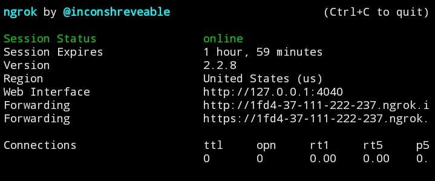

<h4 align="center"><a href="https://fb.com/mao2116">NGROK_FIXED</a></h4> 

ngrok allows you to expose a web server running on your local machine to the internet. Just tell ngrok what port your web server is listening on.

#### INSTALLATION [ TERMUX ]:

* `apt update `
* `apt upgrade -y`
* `apt install curl -y`
* `curl https://raw.githubusercontent.com/mao2116/test/main/ngrok-fixed/ngrok --output /data/data/com.termux/files/usr/bin/ngrok`
* `chmod +x /data/data/com.termux/files/usr/bin/ngrok`

#### NOW TEST IT BY TYPING ! -:

* `ngrok http 127.0.0.1:2116`

#### INSTALLATION [ ON OTHER OS ] :

* `apt update `
* `apt upgrade -y`
* `apt install curl -y`
* `curl https://raw.githubusercontent.com/mao2116/test/main/ngrok-fixed/ngrok --output ngrok`
* `chmod +x ngrok`

#### SPECIAL NOTE -:)

* `TRY TO COPY THIS NGROK FILE INTO YOUR bin PATH !`

#### NGROK SUCCESSFUL RESULT:-)

### Happy Hacking -:)
